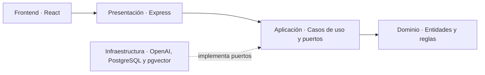

# Administrador Virtual Inteligente

## Resumen

**Administrador Virtual Inteligente para Comunidades de Propietarios** es un Trabajo Fin de Máster que explora cómo los LLM, RAG y las arquitecturas multiagente pueden automatizar tareas administrativas reales.

La aplicación simula la gestión de la comunidad ficticia **Residencial Sierra Nevada** y permitirá:

- Consultar estatutos, normas, actas y contratos mediante lenguaje natural.
- Generar comunicados, convocatorias y actas.
- Clasificar incidencias y sugerir su prioridad y responsable.
- Preparar órdenes del día a partir de incidencias y acuerdos pendientes.
- Coordinar agentes especializados desde una interfaz de chat.

Será una demo pública sin autenticación, con datos precargados y un modo local capaz de funcionar sin servicios externos. El MVP se desarrolla mediante historias de usuario independientes para que cada incremento pueda revisarse e integrarse por separado.

## Estado del proyecto

Actualmente está completada la **US-000**, que establece la arquitectura, las normas de contribución, el control de calidad y la automatización del changelog. La interfaz y la API se incorporarán en las siguientes historias de usuario.

- [Backlog del MVP](docs/backlog.md)
- [Arquitectura detallada](docs/architecture.md)
- [Guía de contribución](CONTRIBUTING.md)

## Cómo arrancar el proyecto

### Requisitos

- Node.js 20 o superior.
- npm 10 o superior.
- Git.

### Preparación local

```bash
git clone <URL_DEL_REPOSITORIO>
cd administrador-virtual-inteligente
npm install
```

En el estado actual todavía no existe un servidor de aplicación. Para verificar que el entorno está correctamente preparado, ejecuta:

```bash
npm run quality
```

Este comando comprueba formato, lint, tipos, pruebas y el fragmento de changelog. Cuando se incorporen el frontend y la API, esta sección incluirá los comandos de desarrollo y las variables de entorno necesarias.

Comandos disponibles actualmente:

```bash
npm run format        # Aplica Prettier
npm run lint          # Ejecuta ESLint
npm run typecheck     # Comprueba TypeScript
npm test              # Ejecuta las pruebas
npm run build         # Verifica la compilación
npm run quality       # Ejecuta el conjunto completo de controles
```

## Arquitectura

El proyecto sigue **Clean Architecture** y los principios **SOLID**. Las reglas de negocio permanecen independientes de frameworks, bases de datos y proveedores de inteligencia artificial.



### Backend

- `domain`: entidades y reglas puras del negocio.
- `application`: casos de uso y contratos para servicios externos.
- `infrastructure`: adaptadores para PostgreSQL, pgvector, OpenAI y el modo local.
- `presentation`: API Express, controladores y validación HTTP.

### Frontend

- `app`: arranque, rutas y proveedores globales.
- `pages`: composición de pantallas.
- `features`: flujos funcionales organizados por historia de usuario.
- `shared`: componentes UI, cliente HTTP, hooks y utilidades reutilizables.

### Paquetes compartidos

Los contratos TypeScript y esquemas Zod comunes al frontend y al backend residirán en `packages/shared`. Las dependencias apuntan hacia el dominio; Express, OpenAI y PostgreSQL se consideran detalles reemplazables.

## Calidad y análisis estático

SonarLint se recomienda en VS Code para obtener feedback inmediato. Cada PR ejecuta ESLint, Prettier, comprobación de tipos, pruebas, compilación, validación del changelog y, cuando se configura `SONAR_TOKEN`, SonarCloud.

Para activar SonarCloud en GitHub hay que definir el secreto `SONAR_TOKEN` y las variables `SONAR_PROJECT_KEY` y `SONAR_ORGANIZATION`. Sin ellas, el análisis Sonar se omite sin bloquear los demás controles.
