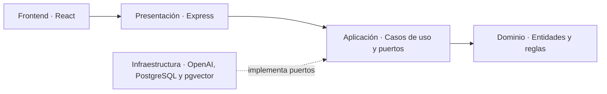

# Administrador Virtual Inteligente

## Resumen

**Administrador Virtual Inteligente para Comunidades de Propietarios** es un Trabajo Fin de Máster que explora cómo los LLM, RAG y las arquitecturas multiagente pueden automatizar tareas administrativas reales.

La aplicación simula la gestión de la comunidad ficticia **Residencial Sierra Nevada** y permitirá:

- Consultar estatutos, normas, actas y contratos mediante lenguaje natural.
- Generar comunicados, convocatorias y actas.
- Clasificar incidencias y sugerir su prioridad y responsable.
- Preparar órdenes del día a partir de incidencias y acuerdos pendientes.
- Coordinar agentes especializados desde una interfaz de chat.

Será una demo pública sin autenticación, con datos precargados y un modo local capaz de funcionar sin servicios externos. El MVP se desarrolla mediante historias de usuario independientes para que cada incremento pueda revisarse e integrarse por separado.

## Estado del proyecto

Actualmente están implementadas la **US-001**, que incorpora el shell responsive de la aplicación, la **US-002**, que añade la API base Express con sesiones demo aisladas, y la **US-003**, que habilita la consulta documental RAG determinista con fuentes trazables.

- [Backlog del MVP](docs/backlog.md)
- [Arquitectura detallada](docs/architecture.md)
- [Guía de contribución](CONTRIBUTING.md)

## Cómo arrancar el proyecto

### Requisitos

- Node.js 20 o superior.
- npm 10 o superior.
- Git.

### Preparación local

```bash
git clone <URL_DEL_REPOSITORIO>
cd administrador-virtual-inteligente
npm install
```

Arranca el frontend en modo desarrollo:

```bash
npm run dev
```

La aplicación estará disponible en [http://localhost:5173](http://localhost:5173). Para verificar que el entorno está correctamente preparado, ejecuta:

En otra terminal puedes arrancar la API:

```bash
npm run dev:api
```

La API quedará disponible en [http://localhost:3000](http://localhost:3000), con healthcheck en `/health`, sesión demo en `/api/session` y consulta documental en `/api/documents/query`. Si la API no está levantada, el frontend usa fallbacks locales deterministas.

Para verificar que el entorno está correctamente preparado, ejecuta:

```bash
npm run quality
```

Este comando comprueba formato, lint, tipos, pruebas unitarias y de integración, compilación, pruebas end-to-end con Playwright y el fragmento de changelog.

El repositorio instala hooks de Git con Husky mediante `npm install`. Antes de cada commit se ejecuta `npm run precommit:check`; antes de cada push se ejecuta `npm run prepush:check`, que delega en la quality gate completa.

Comandos disponibles actualmente:

```bash
npm run format        # Aplica Prettier
npm run dev:api       # Arranca la API Express
npm run dev:web       # Arranca el frontend Vite
npm run precommit:check # Ejecuta los controles rápidos del pre-commit
npm run prepush:check # Ejecuta la quality gate del pre-push
npm run lint          # Ejecuta ESLint
npm run typecheck     # Comprueba TypeScript
npm test              # Ejecuta las pruebas
npm run build         # Verifica la compilación
npm run test:e2e      # Ejecuta los flujos end-to-end en Chromium
npm run quality       # Ejecuta el conjunto completo de controles
```

## Arquitectura

El proyecto sigue **Clean Architecture** y los principios **SOLID**. Las reglas de negocio permanecen independientes de frameworks, bases de datos y proveedores de inteligencia artificial.



### Backend

- `domain`: entidades y reglas puras del negocio.
- `application`: casos de uso y contratos para servicios externos.
- `infrastructure`: adaptadores para PostgreSQL, pgvector, OpenAI y el modo local.
- `presentation`: API Express, controladores y validación HTTP.

### Frontend

- `app`: arranque, rutas y proveedores globales.
- `pages`: composición de pantallas.
- `features`: flujos funcionales organizados por historia de usuario.
- `shared`: componentes UI, cliente HTTP, hooks y utilidades reutilizables.

La aplicación web se encuentra en `apps/web`. La composición y el enrutamiento viven en `app`, la portada en `pages`, los datos y componentes de comunidad en `features/community`, el estado de sesión en `features/session`, y los elementos reutilizables en `shared`.

La consulta documental vive en `features/documents`: la pantalla `/documentos` permite preguntar por estatutos, normas, actas y contratos ficticios, muestra los fragmentos recuperados como fuentes, permite abrir el PDF completo de cada documento en una pestaña nueva y ofrece una biblioteca directa de PDFs sin consulta previa.

La API se encuentra en `apps/api` y separa las capas en:

- `domain/session`: reglas puras de sesión demo.
- `application`: caso de uso `EnsureDemoSession` y puertos.
- `infrastructure`: reloj del sistema, generador UUID y repositorio en memoria.
- `presentation/http`: Express, cookies firmadas, controladores y presentadores.

La US-003 añade el caso de uso `AnswerDocumentQuestion`, el puerto `DocumentRetriever` y un recuperador léxico en memoria. Este adaptador mantiene la demo determinista y prepara la sustitución futura por embeddings y pgvector sin cambiar la capa de aplicación.

### Paquetes compartidos

Los contratos TypeScript y esquemas Zod comunes al frontend y al backend residen en `packages/contracts`. Las dependencias apuntan hacia el dominio; Express, OpenAI y PostgreSQL se consideran detalles reemplazables.

## Calidad y análisis estático

SonarLint se recomienda en VS Code para obtener feedback inmediato. Cada PR ejecuta ESLint, Prettier, comprobación de tipos, pruebas, compilación, validación del changelog y, cuando se configura `SONAR_TOKEN`, SonarCloud.

Para activar SonarCloud en GitHub hay que definir el secreto `SONAR_TOKEN` y las variables `SONAR_PROJECT_KEY` y `SONAR_ORGANIZATION`. Sin ellas, el análisis Sonar se omite sin bloquear los demás controles.
